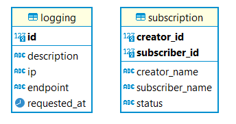

# Milestone 2 IF3110 Pengembangan Aplikasi Berbasis Web

## Deskripsi Aplikasi Web
SOAP Service merupakan Server yang digunakan untuk client Sepotipayi App dan Sepotipayi Premium App untuk mengatur subscription antara pengguna dan penyanyi. Dibuat dengan menggunakan SOAP Protocol dengan mengimplementasikan JAX-WS.

## Daftar Requirement
1. Security
2. Database
3. Subscription handling (CRUD)
4. Logging
5. Sync with Sepotipayi App Database

## Cara Menjalankan Server
> Perlu diperhatikan bahwa terdapat repository https://github.com/apwic/spotify-docker-script untuk mempermudah menjalankan aplikasi secara sekaligus dan **disarankan** untuk menjalankan server melewati repository tersebut.

1. Pastikan docker desktop sudah dijalankan, disarankan untuk melakukan delete terlebih dahulu pada image MySQL yang sudah dimiliki sebelumnya
2. Jalankan perintah `docker-compose up --build`
3. Buka browser dan ketikkan `localhost:7070` pada address bar untuk melihat server yang dibuat

> Untuk melihat daftar port pada docker, jalankan perintah dapat dilihat pada aplikasi docker desktop sesuai dengan container yang dijalankan

## Skema Database

## Pembagian Tugas
1. Security: 13520083, 13520101
2. Database: 13520083
3. Subscription Handling: 13520044, 13520083
4. Logging: 13520044, 13520101
5. Sync DB: 13520083
